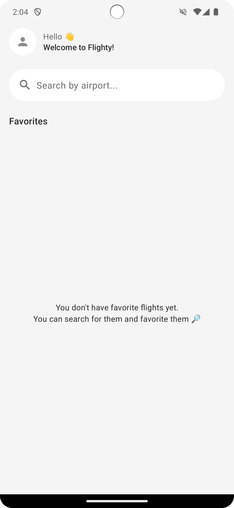
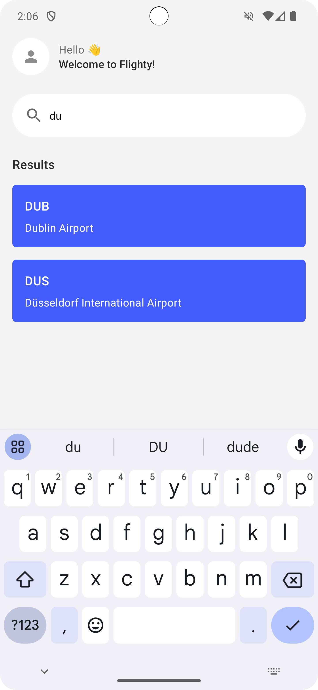
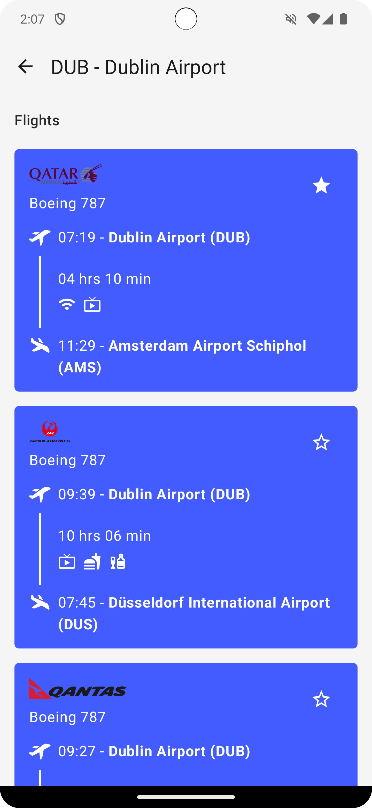
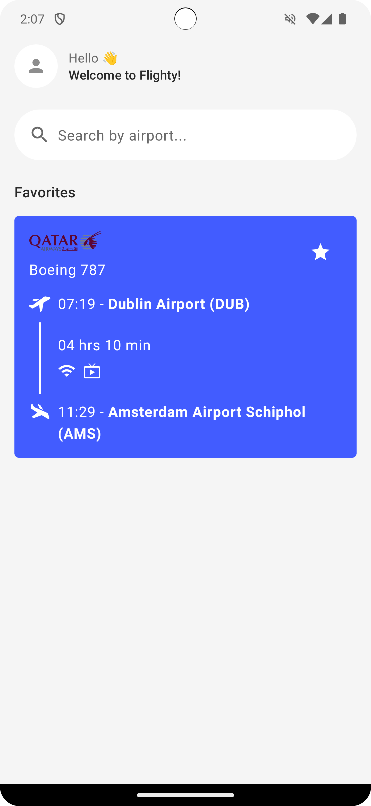

Flighty app
==================================

An Android app that asks the user for a departure airport, searches a pre-populated database to present a list of flights that depart from that airport, lets the user save favorite flights, and updates the database with Room.

It's developed using Jetpack Compose components like ```Column```, ```Button```, ```Text```, ```Image```, and ```Modifier```.

<p align="center">
    
    
    
    
</p>

## Done Tasks

- Provide a text field for the user to enter an airport name or International Air Transport Association (IATA) airport identifier. (✔)
- Query the database to provide autocomplete suggestions as the user types. (✔)
- When the user chooses a suggestion, generate a list of available flights from that airport, including the IATA identifier and airport name to other airports in the database. (✔)
- Let the user save favorite individual routes. (✔)
- When no search query is entered, display all the user-selected favorite routes in a list. (✔)
- Save the search text with Preferences DataStore. When the user reopens the app, the search text, if any, needs to prepopulate the text field with appropriate results from the database. (✔)

Getting Started
---------------

1. Download and run the app.
